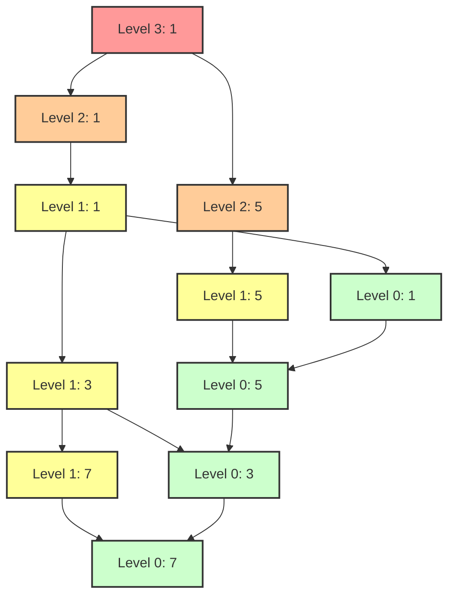
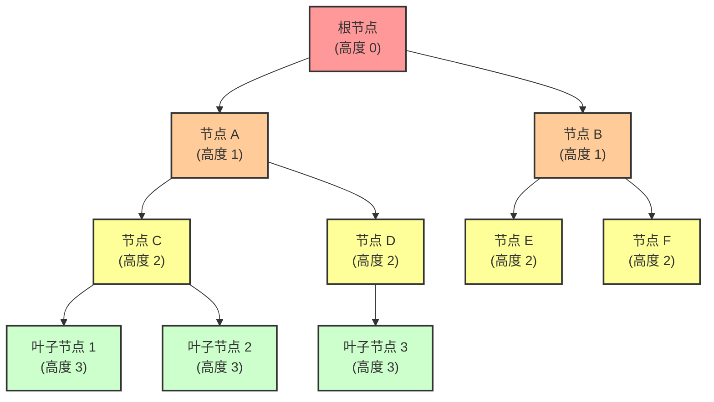

跳表的索引结构按照层级划分，层级越高，索引越稀疏，这一点不同于树结构，树的根在顶部，越往下，树的高度越高。

## 跳表的层级结构

跳表的层级结构特点：**层级越高，索引越稀疏**。所有层级都从底层开始，但高层级只包含部分节点。

**特点说明：**
- 层级从下往上编号（Level 0 是底层，包含所有节点）
- 高层级节点越来越少（索引越来越稀疏）
- 所有层级都指向底层的数据节点

## 树的高度结构

树结构的特点：**根在顶部，越往下，树的高度越高**。每一层都包含节点，形成完整的树形结构。

**特点说明：**
- 根节点在顶部（高度 0）
- 向下遍历时，高度逐渐增加
- 每一层都包含完整的节点结构
- 叶子节点在树的最底层

## 主要区别对比

| 特性 | 跳表 | 树 |
|------|------|-----|
| **结构方向** | 层级从下往上（底层是完整数据） | 高度从上往下（根在顶部） |
| **索引密度** | 层级越高，索引越稀疏 | 每一层都有完整的节点结构 |
| **查找路径** | 从高层级快速定位，再逐层下降 | 从根节点向下遍历到目标节点 |
| **节点分布** | 同一节点可能出现在多个层级 | 每个节点只在一个特定位置 |
